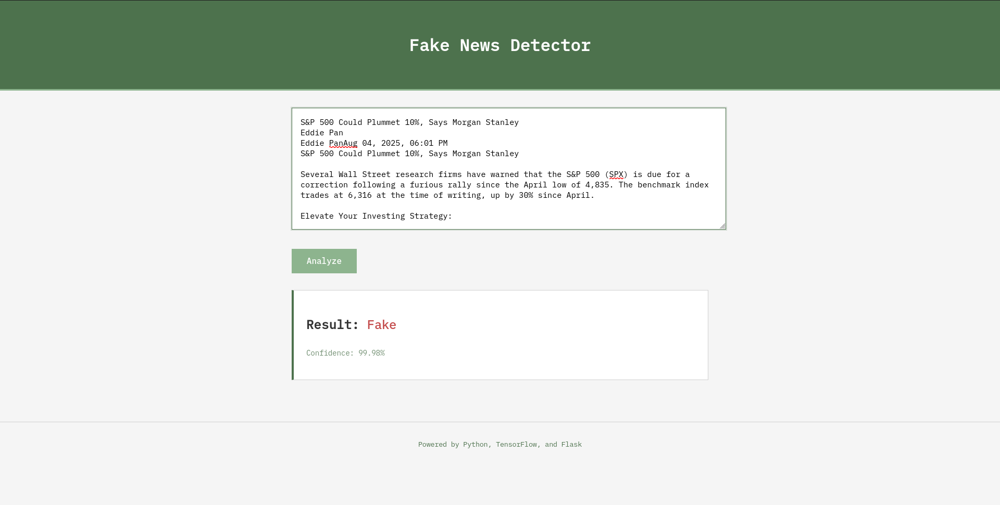

# Fake News Detector

A neural network classifier that detects fake news articles with **85% accuracy**, build with Python and TensorFlow



## Dataset used
The model was trained on the **Fake and Real News Dataset** from [Kaggle](https://www.kaggle.com/datasets/clmentbisaillon/fake-and-real-news-dataset)

## Features
- Pre-trained model (`models/model.h5`)
- Web interface and command-line options
- Supports custom retraining
- Text preprocessing pipeline

## Technologies
- **Python 3.8+**
- **TensorFlow/Keras** -> Model training
- **scikit-learn** -> Text vectorization
- **NLTK** -> Text preprocessing
- **Flask** -> Web interface

## Installation and usage (Quick Start using Pre-trained model)

Prerequisites:
- `Git`
- `Python 3.8+`

### 1. Clone repo
```bash
git clone https://github.com/dinudunareanu/fake-news-detector.git
cd fake-news-detector
```

### 2. Set up environment
```bash
python -m venv venv
```
**Linux/Mac**
```bash
source venv/bin/activate
```
**Windows**
```cmd
.\venv\Scripts\activate
```
Install requirements:
```bash
pip install -r requirements.txt
```

### 3. Run the detector
```bash
python app.py # Web interface at http://localhost:5000
```
**OR:**
```bash
python predict.py # Paste your news article when prompted
```

## Retrain model
1. Download dataset from [Kaggle](https://www.kaggle.com/datasets/clmentbisaillon/fake-and-real-news-dataset)
2. Place `True.csv` and `Fake.csv` in `/data`
3. Run:
```bash
python prepare_data.py # Combines data
python preprocess.py # Cleans data
python train.py # Trains the model (adjust parameters here)
```